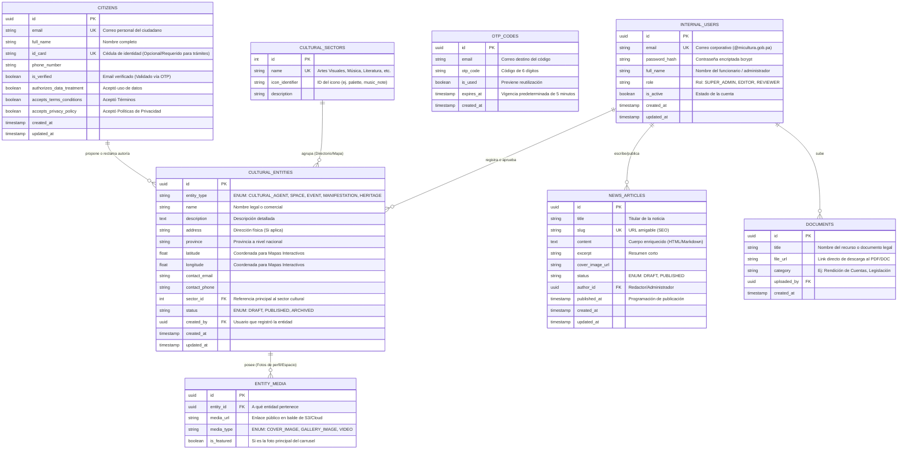

# Arquitectura de Datos (Diagrama Entidad-Relación)

Con base en los **Requerimientos Funcionales** levantados (Directorio Cultural, Mapas Interactivos, Gestión de Identidad y Novedades), este documento expone el diseño del esquema relacional que soporta la base de datos **PostgreSQL**.

## Diagrama Entidad-Relación (ERD)

Este modelo conceptual utiliza las convenciones de `Mermaid` para ilustrar las relaciones entre las entidades fundamentales requeridas por la plataforma del Ministerio de Cultura.

## Diccionario de Entidades Clave

1. **`INTERNAL_USERS` (Gestión Administrativa Interna):** 
   - Soporta exclusivamente a los funcionarios del Ministerio de Cultura. Tienen roles estrictos (`SUPER_ADMIN`, `EDITOR`) y son los únicos con permisos para publicar noticias, subir documentos legales y aprobar/rechazar entidades culturales.
2. **`CITIZENS` (Público General / Ciudadanos):**
   - Entidad apartada para los "ciudadanos de a pie" que se registran desde el portal público. Su cuenta les permite proponer entidades culturales (Ej: Registrar su propia banda musical o teatro), reclamar la autoría de un agente existente, y realizar futuros trámites gubernamentales asociados a su Cédula.
2. **`CULTURAL_SECTORS` (Sectores Culturales):**
   - Sirve como la tabla de catálogos estática para agrupar entidades bajo ramas específicas de arte (Música, Cine, Literatura). Soporta los carruseles de filtros.
3. **`CULTURAL_ENTITIES` (Entidades Culturales Polimórficas):**
   - **El corazón del sistema**. Representa simultáneamente a los "Agentes", "Espacios", "Manifestaciones" y "Eventos". 
   - En lugar de fragmentar 4 tablas distintas con datos idénticos (nombre, descripción, fotos, ubicación), usamos el patrón `entity_type` (Single Table Inheritance) para la indexación ultra veloz de búsquedas transversales. 
   - Contiene las propiedades `latitude` y `longitude` alimentando directamente la vista interactiva nativa del mapa.
4. **`ENTITY_MEDIA` (Multimedia):**
   - Almacena las URL de las fotografías asociadas a cualquier Entidad para renderizarlas en sus tarjetas o perfiles en el Directorio, sin sobrecargar la entidad original.
5. **`NEWS_ARTICLES` (Novedades) & `DOCUMENTS` (Documentos):**
   - Entidades aisladas que respaldan el portal de prensa público (`/novedades`) y el repositorio legislativo/abierto (`/documentos`).

## Recomendaciones a Nivel Infraestructura (DB)
- Configurar índices del tipo `B-TREE` en las columnas `entity_type` y `sector_id` de la tabla `CULTURAL_ENTITIES` ya que el portal filtra constantemente por estos campos.
- Incorporar indexación geoespacial (`PostGIS`) para las columnas de coordenadas (*latitude*, *longitude*) solo en caso de que en un futuro se decida implementar la funcionalidad "Filtrar por x kilómetros a la redonda de mi ubicación". En la versión actual 0.1.0 (marcadores globales sobre Panamá), campos flotantes indexados tradicionalmente son más que eficientes.
